# Отчёт: состояние актива и компактное объяснение

Дата: 09.10.2026. ТЗ: `docs/GROK_SPEC_ASSET_CONTEXT_COMPACT_EXPLANATION_V3_2026-10-09.md`.
Это выбор состояния актива и вид окна. PD текущей ноги, одна карточка BOS, lifecycle зон и удержание HTF-факта после отработки источника сохранены.

Живые цены и границы ниже — наблюдение базы около 18:20 МСК 09.10.2026, не эталон и не прогноз. Число 83 600 в расчёт не входило. Скриншот пользователя сам по себе не доказывает конкретный BOS: уровень ниже доказан свечой, опорой и ключом машины.

## Что изменилось

Состояние актива считает `project_asset`. Направление берётся из канонической ноги H1, если переход доказан и качество данных в порядке. Выбор зоны для просмотра пишет только `navigation.selected_context_id`. Этот идентификатор не входит в `snapshot_id` и не меняет направление, PD и заголовок.

Доказанный переход требует ключ машины из пяти частей, опору `pivot:…`, время слома, совпадающее с суффиксом ключа, и цену закрытия из свидетельства или из закрытой свечи H1. Граница зоны уровнем BOS не становится. Ключ из четырёх частей цену не выдумывает. SMS в строке остаётся SMS.

Обе стороны считаются на одной отсечке. Новый структурный переход главнее старого противоположного. Сценарий той же стороны привязан к ноге, только если создан не раньше её BOS и не позже отсечки. Совпадение `structural_epoch_id` сценария с эпохой ноги не требуется. Эпизод поддерживает направление, если источник был не позже BOS и эпизод к отсечке не закрыт. Отработанный FVG остаётся фактом: «зона отработана, факт поддерживает контекст». Объект в fresh не возвращается.

Список, карточка, стол, подпись графика и текст бота читают одну проекцию. Пока проекция управляет кадром, заголовок списка — её статус, а не код ближайшей зоны. Бот при доказанном переходе печатает уровень структуры, а не `break_level` выбранного сценария.

Окно: один статус и не больше пяти строк. Порядок: BOS с уровнем и временем МСК, основания, зоны и PD, отмена. История, другие контексты, ликвидность и диагностика — под «Подробнее». Одинаковые допущенные интервалы одной геометрии считаются одной зоной. Пересечение ликвидности подписано «пересечение». Новой категории Telegram для «BOS есть, торгового контекста нет» нет. `transition_key` и `ltf_key` не менялись. Чтение проекции сценарии и `ltf_event` не создаёт.

## Почему направление было неверным

Заголовок собирался из выбранного контекста. `build_presentation` ставил направление выбранной зоны и считал условия H1 для этой стороны. При статусе `occurred` код H07 давал «BOS {сторона} подтверждён», а время бралось из `occurred_time` или подставлялось «—». Список копировал эту строку в состояние актива. Ближайшая зона была только способом открыть карточку, но её направление становилось направлением инструмента.

У BTC для просмотра открывался контекст 66: зона 5727463, FVG D1, медвежий, 83 521,15–85 136,11, состояние ожидания структуры. Поэтому кадр смотрел вниз, хотя текущая нога уже была восходящей. Исправление не подменяет надпись и не прячет эту зону: она остаётся в деталях как чужой контекст.

## Откуда 85 136,11

Совпадение с границей FVG есть, и этого недостаточно, чтобы назвать уровень текущим BOS. Независимое происхождение у цены есть, и оно уже историческое.

| Факт | Что записано |
|---|---|
| Опора H1 | pivot 7350, low, роль HL, 85 136,11. Экстремум 06.10.2026 09:00 МСК, подтверждение 06.10.2026 12:59 МСК |
| Медвежий BOS | нога 9, ключ `bos:primary:HL:7350:85136.11@1791338399999`, закрытие 07.10.2026 04:59 МСК. Начало 86 698,99, конец 80 393,56. Сменена 09.10.2026 14:59 МСК |
| FVG | зона 5727463, D1, медвежья, верх 85 136,11. Сформирована 08.10.2026 03:00 МСК, после опоры и после слома |
| Текущая нога | нога 10, бычья, слом LH pivot 7535 на 82 776,01, закрытие 09.10.2026 14:59 МСК. Начало 81 603,52 в 04:00 МСК, конец 83 528,98, ревизия 2, PD подтверждён, 50% 82 566,25 |

В компактном окне 85 136,11 нет. Под «Подробнее» прежний BOS вниз стоит в истории с временем 07.10.2026 04:59 МСК, а FVG с этой границей подписан: структуру не задаёт, структура H1 вверх. Контекст 66 открыт для просмотра, основание — близость к цене.

Восемь бычьих сценариев `monitoring_entries` (3835–3842) созданы 09.10.2026 15:11 МСК, после закрытия этого BOS. Их эпохи структуры — 2, 3, 6, 11, 13, 17 и 25. Эпоха ноги 10 на момент проверки — 378. Связь идёт по времени создания, не по равенству эпох. 32 строки зон входа сходятся в четыре геометрии: FVG 81 996,01–82 045,45, OB 81 617,99–81 948,03, SSL 81 603,52 и SSL 82 400,00. В строке входа их четыре.

## До и после

До: ближайший медвежий FVG задавал сторону заголовка. Уровень 85 136,11 мог попасть в строку «BOS подтверждён» как уровень выбранного сценария. Пустое время события печаталось как «—».

После, один кадр списка, карточки и стола:

- статус: «LONG · ждём откат»;
- «BOS ↑: закрытие выше 82 776,01 · 09.10.2026 14:59 МСК»;
- «Основание: OB W1, OB D1 + ещё 2»;
- «Вход: 4 зоны в discount · 81 603,52–82 400,00»;
- «PD H1 81 603,52 → 83 528,98 · 50% 82 566,25 · PD подтверждён»;
- «Отмена: закрытие H1 ниже исходной опоры ноги, уровень 81 603,52».

HYPE на том же списке: «H1 вниз · торговый контекст не подтверждён». Ближайшая противоположная зона этот статус не заменила. Все пять инструментов остались включёнными.

Пока после перезапуска стоит флаг восстановления истории, тот же актив показывает «Данные H1 неполные», последнее достоверное закрытие с временем и «Новые входы не отправляются». Когда флаги `replaying:*` снялись, статус вернулся к ноге. Это не второй расчёт направления.

## Окно

Снимки сняты в Chrome. Четыре состояния long, short, ожидание и неполные данные собраны тем же `LFCopy.card`, что рисует живую карточку. Short на фикстуре — арифметика 80 400 / 83 400, не живой PD.

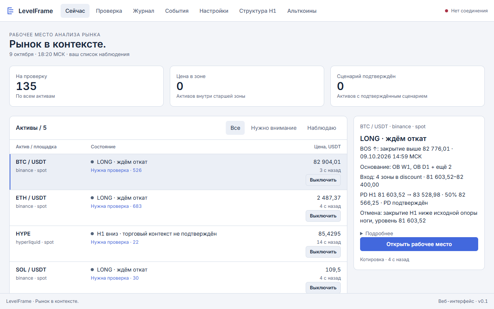

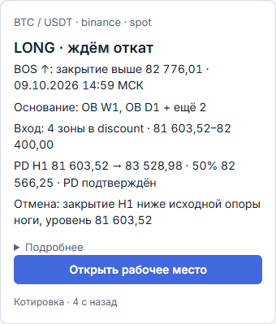

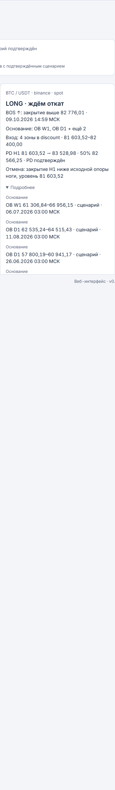

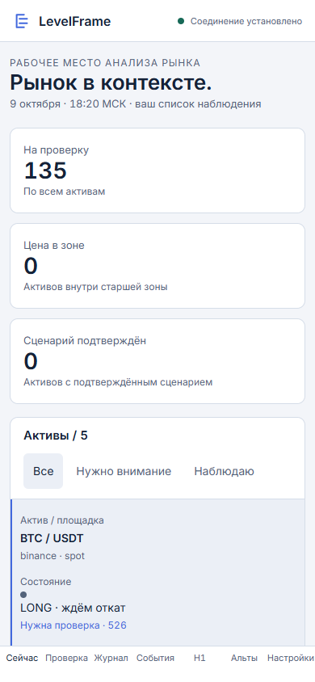

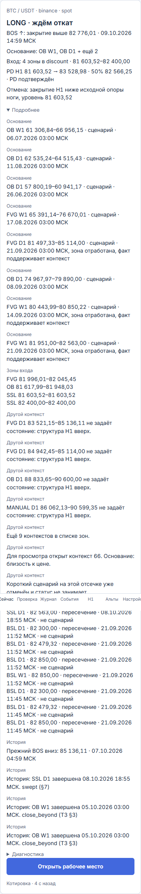

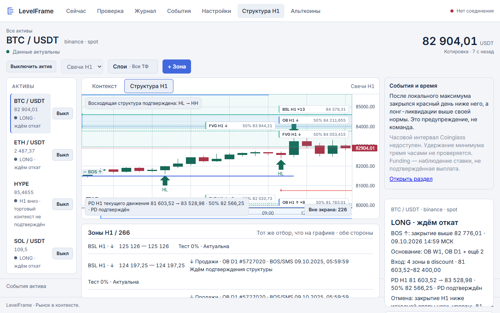

На столе подпись PD совпадает с карточкой: 81 603,52 → 83 528,98, 50% 82 566,25, подтверждён. Строка актива и заголовок сценария оба «LONG · ждём откат». Далёкие зоны остаются «Вне экрана».

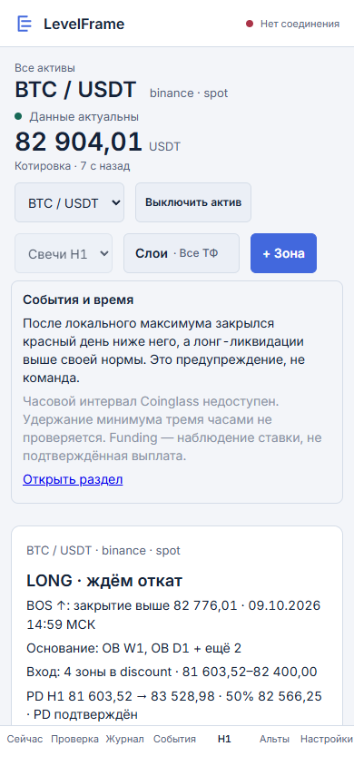

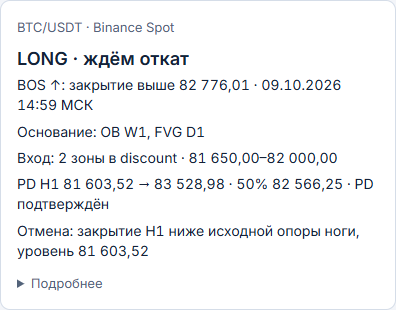

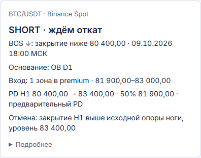

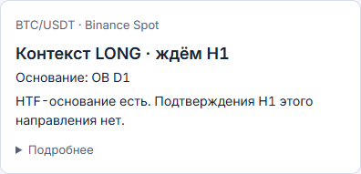

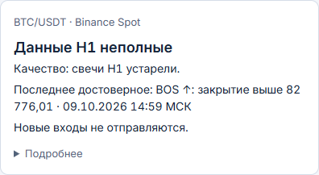

В деталях живой карточки есть отработанные FVG с фразой поддержки контекста, таблица пересечений без sweep/reclaim и прежний медвежий BOS отдельно от оснований. Кнопки «Запустить сверку» в объяснении нет. Сырых `active`, `waiting_structure` и `nearest` в окне нет.

## Приёмка

| № | Проверка | Результат |
|---|---|---|
| 1 | Старый BOS вниз, затем BOS вверх | Структура вверх, 85 136,11 только в истории |
| 2 | Ближайшая медвежья зона при long | Статус long, зона в «Другой контекст» |
| 3 | Ручной выбор short | `snapshot_id`, состояние, структура и PD те же |
| 4 | Цена колеблется | Снимок тот же, `ltf_event` не пишется |
| 5 | Граница FVG без структурного BOS | 85 136,11 не объявляется текущим BOS |
| 6 | Та же цена и доказанная опора | BOS допустим, в строке есть время МСК |
| 7 | Ключ без пяти частей и опоры | «Данные H1 неполные», нет «подтверждён» и нет «—» |
| 8 | BOS вверх без long-контекста | «H1 вверх · торговый контекст не подтверждён», без подмены на short |
| 9 | Long-контекст без BOS | «Контекст LONG · ждём H1», без подтверждения |
| 10 | Эпизод подтверждён, сценария нет | «Состояние уточняется», сценарий чтением не создаётся |
| 11 | FVG отработана, эпизод жив | Фраза поддержки, статус не «Контекст завершён» |
| 12 | Источники обеих сторон | Конфликт структуры не объявляется |
| 13 | Старое событие вставлено позже | Текущим остаётся более поздний по рынку BOS |
| 14 | Завершение 03.03.2025 | В компактном окне даты нет, в истории есть |
| 15 | Три пересечения без возврата | «пересечение», без sweep и reclaim |
| 16 | Short отменён и long открыт на одном баре | Один снимок long, событий чтение не добавляет |
| 17 | Устаревшие H1 | Блок входа, время последнего достоверного BOS |
| 18 | Новый BOS вниз | Статус начинается с SHORT, уровень нового слома |
| 19 | Список, карточка, график, бот | Один заголовок, одно направление, один PD, уровень в подписи |
| 20 | Компактный вид | Один статус, не больше пяти строк, один BOS, без пустого времени |
| 21 | Повторная навигация | `snapshot_id` не меняется, рассылки нет |

SMS не переименовывается в BOS. Отдельный тест держит ключ `bos:primary:bull:5`: пятёрка в конце не становится ценой.

## Как проверялось

1. `pytest` — 1090 passed, 1 xfailed.
2. `node tests/h1_layers_check.js` — «h1 layers ok».
3. Страницы `#now` и `?mode=h1#desk` в Chrome, кадры 1280×800 и 390×844. Ошибок страницы не было. «Запустить сверку» не нажималась. ETHUSDT и остальные четыре инструмента остались с кнопкой выключения.
4. Сразу после перезапуска заголовок BTC был «Данные H1 неполные» из-за восстановления истории. После снятия `replaying:*` повторный просмотр дал «LONG · ждём откат» на списке, в карточке и на столе.

Котировки на кадре были давностью несколько секунд, стол писал «Данные актуальны». Точка соединения в шапке headless-кадра на проверку данных не используется.

Наблюдение 65 и сценарий 2310 не менялись. Автоматический сценарий на GET не создаётся. Отдельного письма «BOS подтверждён, торгового контекста нет» по-прежнему нет.
