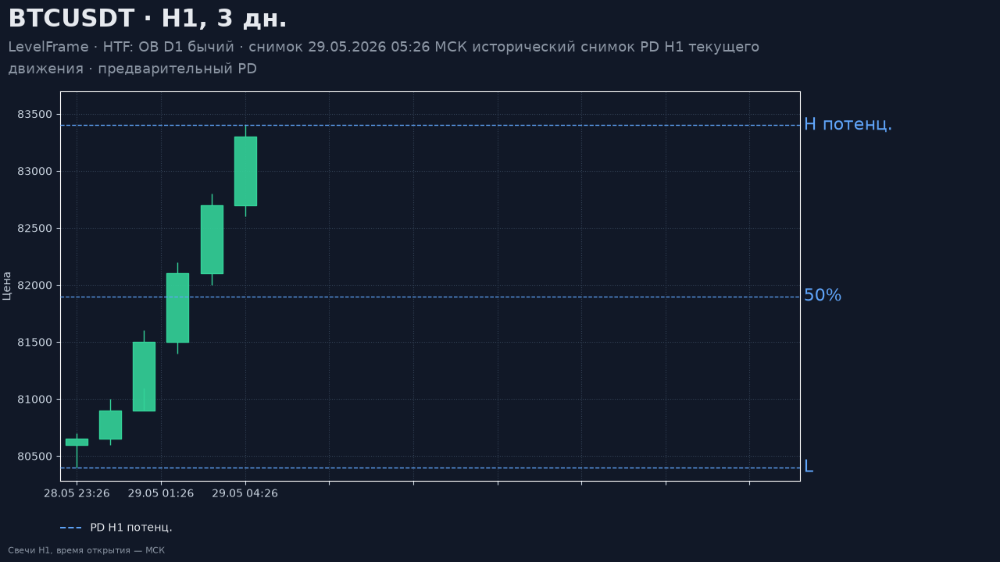
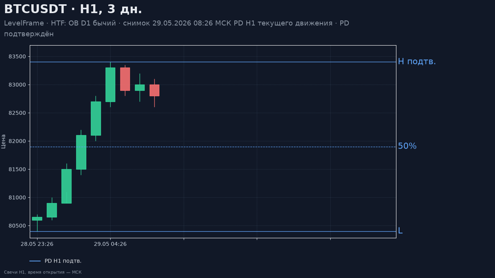
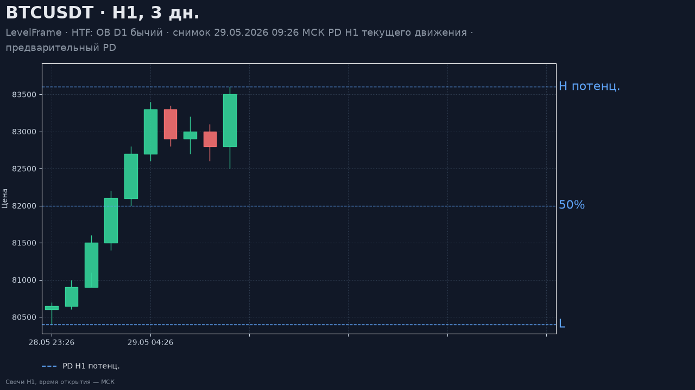
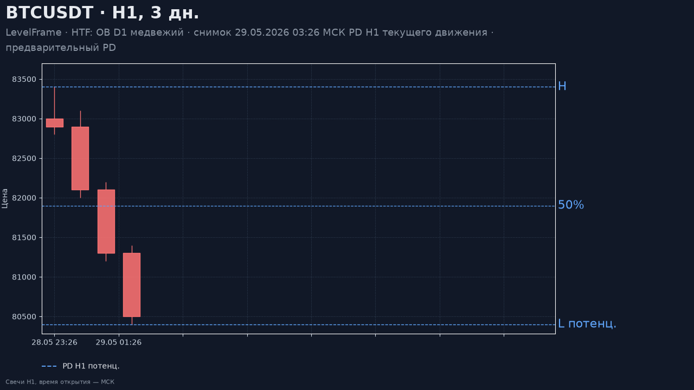

# Отчёт: PD H1 текущего движения

Дата: 09.10.2026. ТЗ: `docs/GROK_SPEC_LOCAL_H1_PD_NOTIFICATIONS_V2_2026-10-09.md`.
Это уточнение выбора PD. Правила HTF-контекста, одной карточки BOS и lifecycle зон из `docs/HTF_CONTEXT_H1_REVERSAL_REPORT_2026-10-09.md` сохранены.

Числа 80 400 / 83 400 / 83 600 — арифметический пример. Котировки со скриншотов в расчёт не загружались. Живой диапазон ниже — наблюдение базы на момент проверки, не эталон и не прогноз.

## Что изменилось

У инструмента на H1 одна текущая нога. Её идентичность — первый причинный BOS, не `scenario_id` родителя. Несколько HTF-родителей дают один и тот же снимок. Старая нога остаётся в журнале и помечается исторической, когда открывается новое самостоятельное движение.

Начало ноги — последний подтверждённый pivot того же вида, известный к моменту BOS и не позже открытия свечи слома. Если такого pivot нет, берётся структурный экстремум закрытых свечей после предыдущего противоположного pivot. Поле `anchor_price` из разбора слома началом навсегда не становится. Происхождение не доказано — `range_pending` / `origin_unresolved`, старые цены не копируются.

После подтверждённого BOS диапазон считается сразу до уже наблюдаемого экстремума закрытых H1. Подтверждение pivot меняет статус на `confirmed` и нового BOS не создаёт. Новый экстремум той же ноги снова делает конец предварительным и пишет отдельную ревизию. Локальный HL внутри ноги начало не сдвигает. Несколько сломов одного импульса без структурной коррекции остаются одной ногой. Коррекция и новый BOS продолжения открывают ногу от нового HL/LH. Обратный BOS переключает направление.

Снимок `project_setup` общий для движка, API, веб-графика, PNG и текста карточки. `mode=current` — живой кадр. `mode=event` — кадр на время события, прошлые ревизии не переписываются. Открытая H1 может попасть только в подпись «текущая свеча» и EQ не двигает.

Зоны считаются по окну этой ноги, включая основание. Зона другой ноги текущей не становится из-за пересечения с новой половиной. Допущенный участок long — пересечение с discount, short — с premium. Первое закрытие, которое только что открыло допуск, касанием входа не считается.

Уведомление уходит на рыночный переход. Пересчёт того же диапазона, смена EQ, подтверждение pivot и повторный просмотр старого PD отдельный торговый алерт не создают. Первая синхронизация ног писем не шлёт. Категории «BOS подтверждён, торговый контекст отсутствует» в Telegram нет: отдельного переключателя у пользователя нет, строка остаётся в подписи карточки.

Таблицы `h1_local_leg` и `h1_local_leg_revision` создаёт обычный `Database.migrate` через `IF NOT EXISTS`. Журнал сценариев и `ltf_range` не удалялись.

## Почему на графике были далёкие диапазоны

`htf_context_leg` в живой базе пуст: 0 строк. Далёкие границы лежали в `ltf_range` старых сценариев. У BTC таких строк с `lower >= 100000` — 149, в том числе 13 с нижней границей от 109 000 и верхней не выше 113 000. Отдельные группы 88–93 тыс. повторяются по 15–20 сценариев. Это журнал наблюдений, не текущая нога.

Пока график брал `ranges[].current` последнего сценария, эти границы становились рабочим PD. Теперь при построенной ноге рабочий PD — её снимок. Старые строки в журнале остаются и на ось эталонного PNG не попадают: тест держит масштаб около 70–100 тыс., в подписи есть «вне окна» и «9 000,00», строк «109 000,00» и «88 000,00» нет.

## Опоры

| Кадр | Движение | Начало | Конец | EQ | Статус |
|---|---|---|---|---|---|
| Арифметика, сразу после BOS | long | 80 400 | 83 400 | 81 900 | предварительный |
| Тот же пример, pivot high подтверждён | long | 80 400 | 83 400 | 81 900 | подтверждён |
| Тот же пример, закрытый high 83 600 | long | 80 400 | 83 600 | 82 000 | снова предварительный |
| Зеркало | short | 83 400 | 80 400 | 81 900 | предварительный |
| BTC, нога 9, уже сменена | short | 86 698,99 | 80 393,56 | журнал | историческая |
| BTC, нога 10 на момент проверки | long | 81 603,52 | 83 528,98 | 82 566,25 | предварительный, текущая |

Нога 10: `state=developing`, `bos_at` совпадает с `superseded_at` ноги 9, ревизия 1. Конец 83 528,98 — закрытый экстремум этой ноги, не число 83 600 из арифметики и не 82 776,01 со скриншота. 83 600 в PD не подставлялось: эта цена в живых свечах проверки не использовалась.

Пример строк карточки на арифметике. Сразу после BOS: «Текущее движение: 80 400,00 → 83 400,00. Верхний pivot потенциальный.» и «PD H1: 80 400,00–83 400,00, 50%: 81 900,00. Предварительный PD.» После 83 600 середина — «82 000,00». Short: «83 400,00 → 80 400,00. Нижний pivot потенциальный.»

## График

Четыре PNG сняты рендером `render_ltf_chart`, не генерацией картинки.

Исторический кадр на закрытии BOS. Пунктир, подпись «H потенц.», середина 81 900, легенда «PD H1 потенц.», в подзаголовке «исторический снимок».

Тот же диапазон после подтверждения верхней опоры. Сплошные границы, «H подтв.», легенда «PD H1 подтв.», пометки истории нет.

Новый закрытый high 83 600 возвращает предварительный статус. Середина 82 000, подпись снова «H потенц.».

Зеркало: начало 83 400, потенциальный low 80 400, родитель в подписи медвежий.

На столе линии PD идут от начала ноги. Предварительный диапазон пунктирный, подтверждённый сплошной, середина дополнительно пунктирная. Далёкий HTF-источник остаётся текстом «вне кадра (вне окна)» и ось текущей ноги не растягивает.

## Уведомления

Повод — новый BOS, первое появление допущенных зон и фактическое касание допустимой части. Повтор того же диапазона, смена только EQ или статуса pivot, чужая нога и replay письмо не создают. Если нога уже сменилась, входовой пакет подавляется с причиной. Обычный BOS без ключа рыночного перехода сохраняет прежний текст. `delivery_unknown` по-прежнему статус `uncertain`.

Строка без торгового контекста: «BOS подтверждён, торговый контекст отсутствует. Это не готовый вход.» Она не объявляет готовый сетап.

## Пометка «история» на живом кадре

Первый просмотр стола после включения ног помечал текущую развивающуюся ногу историей. `instrument_structure` всегда передавал в сборку уже вычисленный момент, а снимок считал любой непустой `as_of` кадром события. Строка в базе при этом была `developing`.

Исправление: история PD включается только когда клиент сам передал `as_of`. Заполненный сервером «сейчас» остаётся `mode=current`. Явный прошлый `as_of` по-прежнему `mode=event` и пишет «Исторический снимок».

Повторная проверка стола, `?mode=h1#desk`, после одного перезапуска:

- подпись: «PD H1 текущего движения 81 603,52 → 83 528,98 · 50% 82 566,25 · предварительный PD»;
- слова «история» в подписи нет;
- три линии `.h1-pd-line`, класс `provisional`;
- API: `history=false`, `mode=current`, `state=developing`, 6 кандидатов;
- меню слоёв внутри кадра 1280×800 и 390×844;
- страница `ltf.html?stay=1` рисует три линии снимка, подсказка совпадает с тем же диапазоном и без пометки истории;
- Binance BTCUSDT и ETHUSDT остались включёнными, `ltf_analyze` тоже.

На узком кадре бейдж соединения в headless на мгновение оставался красным уже после отрисовки подписи. Данные кадра при этом были на месте.

## Приёмка

| Проверка | Результат |
|---|---|
| Старые PD 109–112 тыс. и 88–91 тыс. при цене около 83 тыс. | Не выбираются текущими. PNG их не содержит. В живой базе такие строки журнала есть и на подпись стола не попали |
| Несколько HTF-родителей одного движения | Один `movement_id`, один `snapshot_id`, один EQ |
| BOS вверх, high ещё не confirmed pivot | Сразу provisional PD и кандидаты ноги, в том числе FVG у основания |
| BOS вниз, low ещё не confirmed pivot | Зеркальный premium, PNG short |
| Новый фактический экстремум | Граница и EQ обновлены отдельной ревизией, `ltf_event` не пишется |
| Новая восходящая нога выше старого high скриншота | На живых данных это нога 10: 81 603,52 → 83 528,98. Число 82 776,01 фикстурой не было |
| Экстремум, которого цена не достигла | В PD не входит |
| Локальный HL без нового BOS | Начало и нижние зоны ноги сохраняются |
| Коррекция и BOS продолжения | Новая нога, прежняя историческая |
| Несколько сломов одного импульса | Одна нога, несколько фактов |
| Обратный BOS | Направление и PD переключаются, старый вход подавляется |
| Происхождение не доказано | `origin_unresolved`, старый EQ не копируется |
| Неподтверждённый OB/FVG | `forming`, без торгового допуска |
| Зона старой ноги внутри нового discount | Текущей не становится |
| Допуск открылся на том же закрытии | Касанием входа не считается |
| Pivot подтвердился без новой геометрии | Меняется статус ревизии, нового BOS нет |
| Далёкий HTF-источник | Текст «вне окна», масштаб ноги сохранён |
| Явный прошлый кадр | `history=true`, EQ на тот `as_of` |
| Повторный прогон и молчаливый replay движка | Строки не двоятся, писем нет |
| API, веб, PNG и текст карточки | Один `project_setup`: направление, границы, EQ, статус |
| Длинные подписи | Цены с двумя знаками и русскими разделителями, на PNG читаются |

## Как проверялось

1. `pytest tests/test_h1_local_pd.py tests/test_h1_chart.py tests/test_htf_context_reversal.py` — 60 passed.
2. `node tests/h1_layers_check.js` — «h1 layers ok».
3. Полный `pytest` — 1067 passed, 1 xfailed, 135,51 с.
4. Четыре PNG в `docs/h1_pd_v2/` просмотрены.
5. Один перезапуск `app.main`. На порту 8000 один слушатель, `GET /` вернул 200.
6. Браузер: стол H1 на 1280×800 и 390×844, затем `ltf.html?stay=1`. Ошибок страницы не было. Кнопка сверки не нажималась.

Живая база отдельно не мигрировалась. Десять ног BTC записала обычная первая сборка снимка. Повторный просмотр при той же последней закрытой свече ноги заново не плодит.

## Ограничения

Свечи трёх скриншотов в прогон не входили, поэтому пара «пиксель скрина → свеча» не строилась. 83 600 относится только к арифметическому примеру. Живые 81 603,52 и 83 528,98 описывают ногу на момент проверки и со следующей закрытой H1 могут сдвинуться.

На странице LTF рядом со снимком ноги по-прежнему видны зоны и уровни других объектов. Они расширяют шкалу. Рабочие линии PD при этом берутся из снимка ноги.

Новые причины допуска записаны на снимке. Кортеж `ELIGIBILITY_REASONS` не расширялся.
