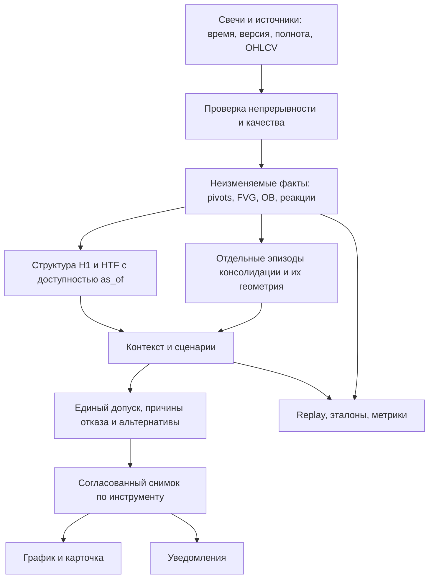

# Аудит качества зон, H1 и диапазонов альткоинов

Дата: 8 октября 2026. Основание: текущий checkout `441c200` с уже существовавшими локальными изменениями, локальная БД `data/htf_zones.db`, тесты и сохранённые OHLC-эталоны. Статус: анализ и план реализации; торговая логика и рабочая БД в рамках аудита не изменены.

## Главный вывод

Система уже содержит полезную основу: причинные движения, подтверждение pivots, отдельные жизненные циклы зон, версионирование диапазонов, replay и объяснения решений. Но надёжность текущей рыночной интерпретации ещё не доказана. Обнаружены воспроизводимые ошибки временного контекста H1, выбора актуальной базы и обработки неполных свечных рядов. На сохранённых примерах новая версия альткоинов улучшает отдельные активы, но совпадает по границам лишь с 2 из 10 размеченных баз.

Кардинальное улучшение должно объединить три направления: **временная корректность данных и состояний → измеряемое качество геометрии и выбора → единый объяснимый анализ HTF/H1/альткоинов**. Простое увеличение количества паттернов или настройка порогов под несколько скриншотов этого не обеспечит.

## 1. Что проверено и чего цифры не означают

- Прочитаны детекторы FVG/OB/ликвидности, структура и контекст H1, допуск HTF-родителей, v1/v2 альткоинов, выбор текущего эпизода, загрузчики и проверки качества.
- Рабочая БД прочитана через SQLite `mode=ro`, без конструктора `Database`, который мог бы запустить миграции. Повторяемый снимок выполнен в одной read-транзакции.
- Запущен штатный `tools/alt_replay_compare.py`: восемь сохранённых D1-серий, разметка на 06.10.2026. README набора указывает Binance Spot; первоисточник свечей в этой работе повторно не скачивался. Исходные скриншоты в репозитории отсутствуют, границы проверены относительно `markup.json`.
- Завершённые целевые прогоны: **67 тестов HTF/H1 и 55 тестов альткоинов прошли**. Вызов первого набора вернул shell exit code 1 при pytest summary `67 passed`; поэтому его нельзя представлять как полностью успешный CI-job. Второй набор завершился с exit code 0.
- Общий pytest-прогон был прерван `KeyboardInterrupt` после `442 passed`; промежуточный смешанный прогон — после `97 passed`. Эти числа пересекаются с целевыми наборами и не складываются. Полное прохождение suite не подтверждено; причина прерывания не установлена.
- Дополнительно выполнены семь изолированных проверок проблемных случаев; результаты сохранены в [JSON аудита](audit/detection_quality_2026_10_08.json), скрипт — [audit_detection_quality.py](../tools/audit_detection_quality.py).

Зелёные unit-тесты подтверждают заданное поведение. Они не устанавливают полноту обнаружения рыночных зон, доходность входов или вероятность отработки. Для этих оценок нужен отдельный размеченный набор и проверка на периодах, не участвовавших в настройке.

## 2. Состояние установленной локальной системы

| Проверка | Наблюдение | Значение для аудита |
|---|---|---|
| Основные инструменты | BTC, ETH, SOL; у всех включён H1-анализ | Выводы по сохранённой эксплуатации ограничены этими инструментами |
| H1-история | BTC 18 616, ETH 9 376, SOL 9 712 закрытых свечей в сохранённом снимке | Данных достаточно для локальных replay-проверок; это не гарантирует корректность сценариев |
| Непрерывность | В сохранённых закрытых H1/D1/W1-рядах разрывов не найдено | Ошибка детектора на разрывах — воспроизведённый пограничный случай, а не доказанная причина текущих зон |
| Версии HTF | 3 892 строки с `rule_version=0.1`, 55 с `0.2`; сохранённый профиль также содержит `0.1` | По метке версии нельзя уверенно восстановить фактически применённые правила. Это не доказывает, что все старые строки рассчитаны старым кодом |
| Открытые наблюдения H1 | 35, из них 6 связаны с родителями, имеющими завершение рисунка или архивный статус | Сохранённые состояния не полностью согласованы. Новый API может их отфильтровать; это не доказывает показ всех шести пользователю |
| Альткоины в БД | 0 активов, 0 свечей; таблиц `alt_range_episode`/`alt_sweep_episode` нет | Новая версия в этой БД ещё не материализована |
| Последний сохранённый alt-run | `no_universe`, `processed=0`, причина `CMC_API_KEY not configured` | В этом локальном запуске анализ альткоинов не состоялся. Состояние другой установки и её ENV не проверялось |
| Версия alt по умолчанию | `AltConfig.engine_version="v1"` | Наличие `engine_v2.py` не означает его использование раннером |

Из 47 последних нормализованных оценок геометрии: 30 `valid`, 16 `invalid`, 1 `unknown`. Это выбранная для review выборка, а не случайная выборка всех зон; превращать её в общую точность нельзя. Старые `rejected`, новые `wrong_type` и замечания о lifecycle тоже нельзя складывать в один класс ошибок геометрии.

Уже исправленные механизмы следует сохранить: единый `parent_decision` допускает подтверждённый candidate; H1-структура рассчитывается без наблюдений; `evaluate_final` запрещает терминальные SSL/BSL; в локальном профиле уже включено `OB,FVG`. Прежний документ об инциденте SOL не описывает целиком текущий код.

## 3. Наиболее существенные недостатки

P0 — препятствует доверию к историческому анализу/оценке качества; P1 — существенно ухудшает выбор и интерпретацию; P2 — следующий уровень качества. В каждой записи отделены воспроизведённый факт и предлагаемое изменение.

### A01 · P0 · H1-контекст не соблюдает момент доступности D1 FVG

**Факт.** `app/engine/ltf/context.py:83`, `find_htf_fvg50_test()`, фильтрует зоны по `formed_at`, а геометрическое подтверждение также сравнивает только `formed_at` с временем теста. `confirmed_at` не проверяется. При начале третьей D1-свечи 01.01 00:00 UTC и подтверждении 02.01 00:00 запрос на 01.01 12:00 возвращает `confirmed=True`.

В live ранее не созданная зона может ещё отсутствовать в БД, но replay по уже заполненной HTF-истории получает информацию раньше её доступности. Это достаточно серьёзно, чтобы не доверять сравнению исторических H1-сценариев без исправления.

**Изменение.** Разделить `formed_at`, `available_at/confirmed_at`, `occurred_at`, `detected_at`. Контекст зоны допустим только после доступности подтверждения, причём до самого проверяемого теста. Формирующаяся D1 FVG может быть отдельной гипотезой, но не подтверждённым контекстом.

**Приёмка.** Добавление будущих HTF-свечей не меняет H1-решения на прежний момент; отдельно проверить момент до D1 close, ровно после close и многодневный catchup.

### A02 · P0 · Текущий статус зоны переписывает исторический ответ

**Факт.** Та же функция сначала выбирает только текущие `ACTIVE/WEAKENED`. В изолированном примере запрос на один и тот же `as_of` сначала возвращает FVG, а после её более поздней архивации — `None`. Историческое состояние зоны не восстанавливается.

В `_process_candle()` H1 значение `now` берётся из `detected_at`; live/catchup передаёт фактическое время обработки, replay — время свечи. Затем `_update_scenario_context()` передаёт `as_of=now`. Следовательно, нужно проверить и унифицировать не только отдельный фильтр, но и смысл времени всего расчёта.

**Изменение.** Ввести общий `state_at(as_of)` по журналу переходов либо версионированным интервалам действия. Рыночное решение рассчитывать на закрытие обрабатываемой свечи; фактическое время обнаружения использовать для задержки и доставки.

**Приёмка.** Одинаковые рыночные факты и eligibility при пошаговом live, пакетном catchup и replay. Допускаются различия только в явно операционных полях доставки/обнаружения.

### A03 · P1 · Старая база может снова стать главным диапазоном

**Факт.** `app/services/alt_overview.py:1334` возвращает `inside_base` раньше проверки срока сопровождения. `select_current_episode()` ставит эту категорию выше недавнего выхода и возвращает альтернативы только из победившей категории.

Воспроизведение: цена 15; старая база 10–20 с выходом 389 дней назад; новая база 11–14 с выходом 9 дней назад. Выбрана старая, причина `inside_base`, список альтернатив пуст. На реальных сохранённых эталонах HBAR выбран эпизод с якорем апреля 2024, TAO — июня 2024.

**Изменение.** Разделить актуальную консолидацию, сопровождение выхода и исторические уровни. Проверять завершение/давность до категории «цена внутри». Возврат в старую область показывать как тест исторической зоны, не возобновлять старое накопление. Сохранять релевантные альтернативы из всех категорий. Выбор должен учитывать качество и завершённость эпизода, а неоднозначность — близость оценок, а не только точное равенство времён.

**Приёмка.** Воспроизведённый случай не скрывает свежий эпизод; историческая база не становится текущей лишь из-за попадания цены в её границы.

### A04 · P1 · В геометрии alt v2 осталось два источника чрезмерного объединения

**Факт 1.** `app/alt/engine_v2.py:185`, `cluster_pivots()`, сравнивает соседние цены, не полный диаметр кластера. При допуске 1 цены 100, 100.9, 101.8, 102.7 сливаются в один кластер шириной 2.7. У HTF `cluster_prices()` уже есть защита от такого цепочного расширения, но alt использует другой алгоритм.

**Факт 2.** `choose_lu_pair()` ранжирует по `(round(containment, 2), width, ...)`: при равном округлённом охвате предпочитает более широкую пару раньше числа реакций. Это прямое поощрение ширины в выборе, хотя классификатор описан как независимый от ширины. Само по себе это не доказывает причину каждого промаха из таблицы ниже.

**Изменение.** Ограничить диаметр/разброс кластера относительно ATR и шага цены. Сначала сегментировать эпизод, затем оценивать его границы. Сравнивать независимые реакции, охват, устойчивость, выходы из диапазона и ошибки по времени; штрафовать объединение разных режимов. Не менять знак предпочтения на «всегда самый узкий».

**Приёмка.** Ценовая лесенка не образует одну зону неограниченной ширины; один выброс не перемещает обе границы; новая локальная база не поглощает предшествующее направленное движение. Узкие и широкие правильные базы присутствуют в holdout.

### A05 · P0 для валидации · Приёмка альткоинов недостаточно измеряет попадание в задачу

**Факт.** Все 55 выбранных alt-тестов проходят, при этом штатный сравнительный replay совпадает только с 2 из 10 размеченных баз. В acceptance для части активов проверяются более слабые признаки: два разнесённых цикла; у SUI верх меньше 2; у AAVE историческая база не выбрана текущей. Эти проверки полезны, но не заменяют проверку ожидаемых границ и времени базы.

Сам измеритель тоже неполон: `tools/alt_replay_compare.py` матчит базы по L/U без обязательного совпадения временного интервала; окно конца базы проверяется отдельным полем, не обязательным условием `matched`. В `FROZEN_STATES` включён `decayed`, хотя таким бывает и кандидат, распавшийся до зрелости. Неразмеченные эпизоды названы `false_bases`, хотя разметка не исчерпывает всю историю.

**Изменение.** Исправить измеритель до дальнейшей оптимизации движка. Сделать взаимно однозначное соответствие эпизодов по времени и цене, различать неразмеченное/ошибочное/незрелое. Добавить проверку выбора главной базы, момента доступности и задержки обнаружения.

**Приёмка.** Намеренно сдвинутый на год диапазон с теми же ценами не засчитывается; незрелый decayed не считается опубликованной зрелой базой; неправильный selected episode проваливает отдельную метрику даже при наличии правильного кандидата.

### A06 · P1 · HTF/H1 принимают соседние записи за последовательные свечи

**Факт.** `scan_fvgs()` сортирует свечи, но не проверяет расстояние между `open_time`. Для дней 0, 1, 4 получен FVG как для трёх последовательных свечей. Детекторы pivots также используют окна по индексам. Alt-runner записывает gaps в диагностику; сам факт записи gaps не запрещает расчёт через разрыв.

**Изменение.** Общий валидатор ряда: непрерывные сегменты, корректность OHLC, уникальность, закрытость, точная длительность ТФ, источник, версия данных. Паттерны не пересекают неподтверждённый разрыв; восстановление данных вызывает ограниченный replay зависимых фактов. Не заполнять пропуски выдуманными свечами.

**Приёмка.** Удаление средней свечи отменяет зависимый паттерн и даёт понятную причину недостаточности данных. После восстановления результат совпадает с непрерывным эталоном.

### A07 · P1 · Допуск родителя неполон по данным и ручным подтверждениям

**Факт.** `parent_decision()` допускает `needs_replay=True`. Родитель с `source="manual"` и `confirmed_at` в будущем также допускается на более раннем `as_of`: ручной флаг обходит этот фильтр. Это поведение воспроизведено изолированно; появление конкретного ошибочного пользовательского сигнала через всю цепочку не проверено.

**Изменение.** Развести геометрическую/рыночную валидность и достоверность истории. Неполные данные могут разрешать показ контекста, но должны блокировать утверждение о проверенной пригодности для нового входа. Для ручной разметки хранить время фактического внесения и отдельную ретроспективную аннотацию; не давать ручному источнику общую индульгенцию на время доступности.

**Приёмка.** Replay не использует решение, внесённое позднее. `needs_replay` виден во всех каналах и не теряется при переходе к H1.

### A08 · P1 · HTF-зона обнаруживается формально, её значимость отдельно не доказана

**Факт.** FVG — любой строгий трёхсвечный разрыв; в `scan_fvgs()` нет минимального размера в тиках/ATR. OB строится от противоположной свечи после пропуска свечей цвета импульса; база расширяется, пока тела предыдущих свечей входят в диапазон. Есть полезная трассировка и пометка технического лимита, но качество импульса, минимальное ценовое продвижение и устойчивость основания не образуют отдельный калиброванный уровень качества. Базовые допуски 2% и часть параметров прямо обозначены `uncalibrated`.

**Следствие.** Формальное существование FVG/OB легко воспринимается как достаточная значимость для анализа. Похожие цены с разной волатильностью получают одинаковые процентные допуски. Возможны чрезмерные базы и микрозоны; частоту этих ошибок текущий аудит не измерил.

**Изменение.** Сохранить факты паттернов, добавить отдельный уровень квалификации: размер в тиках и ATR, сила/скорость выхода, число возвратов, глубина тестирования, возраст с последней реакцией, положение в старшем диапазоне. Держать базовое правило владельца отдельным от экспериментального отбора. Не называть эвристический балл вероятностью отработки.

### A09 · P1 · H1-структура нуждается в иерархии и измерении задержки

**Факт.** Pivots H1 подтверждаются правыми свечами, обычно 3; равные вершины/днища не дают strict pivot, двусторонняя свеча помечается ambiguous. BOS/SMS проверяют строгое закрытие за уровнем без отдельного порога величины пробоя. Цикл H1 по умолчанию ждёт 300 секунд после прохода. Это не пять минут полной задержки pivot: отдельно есть ожидание правых свечей, отдельно доставка после доступности факта.

**Изменение.** Разделить внутреннюю структуру движения и внешнюю структуру сценария; применить одинаковую политику выбора масштаба на всех инструментах. Равные экстремумы представить как площадку ликвидности с допуском по tick/ATR. Формальный пробой и качество пробоя хранить раздельно; фильтр качества включать только по результатам независимой проверки. События закрытия H1 обрабатывать сразу после получения закрытой свечи, оставив polling для восстановления.

**Приёмка.** Отдельные метрики: задержка от экстремума до подтверждения; от подтверждения до расчёта; от расчёта до доставки. Предварительная структура визуально отличается и не включается в подтверждённые сигналы. Изменение масштаба pivot не должно тихо перезаписывать уже опубликованную историю.

### A10 · P1 · «Анализ альткоинов» сейчас существенно уже общего рыночного анализа

**Факт.** Модуль ориентирован на D1-накопление после просадки 80%, с порогами 51/101 день и дополнительной стабильностью пары. Universe выбирается по рангу CMC 11–300 и исключениям категорий. В общей модели `Candle` нет объёма; alt-loader получает `volume=0` через fallback. Отбор не оценивает фактическую ликвидность пары по spread/обороту; относительная сила к BTC/ETH в просмотренной цепочке отсутствует.

Это ограничение продукта, а не ошибка относительно исходной стратегии накопления. Продолжение сильного тренда, короткая база или менее глубокая коррекция могут не попадать в область поиска по замыслу.

**Изменение.** Явные режимы: накопление после падения, продолжение тренда, локальная консолидация, выход/ретест, распад, недостаточно данных. Режим должен иметь собственные эталоны и критерии; не смешивать их в одну машину с десятками исключений. Сохранять OHLCV и характеристики выбранной пары; missing volume отличать от нулевого. Добавить BTC/ETH-relative-strength и рыночный режим как контекст, проверить их добавочную пользу. Профиль D1/W1 → H1 сохраняется; введение H4 не требуется для этого плана.

Ключ CMC не должен быть единственной точкой отказа: предусмотреть явно выбранный ручной список активов или последний валидный universe с датой и признаком устаревания. Альтернативный universe не выдавать за актуальный рейтинг CMC.

## 4. Фактический результат alt replay

| Актив | Размеченных баз | Совпало L/U | Существенное наблюдение |
|---|---:|---:|---|
| NEAR | 2 | 0 | Актуальный эпизод не выбран; обе заданные базы не совпали |
| SUI | 1 | 0 | Локальная база есть, но геометрия отличается от разметки |
| HBAR | 2 | 0 | Текущей выбрана старая база с якорем апреля 2024 |
| TAO | 1 | 0 | Предпочтён эпизод 2024, широкая заданная база не совпала |
| ENA | 1 | 1 | База 0.08545–0.1384 совпала; выход попал в проверяемое окно |
| PUMP | 1 | 1 | Нужная база 0.001678–0.003299 найдена, но selected — другой эпизод 0.001346–0.002654 |
| AAVE | 1 | 0 | Историческая база не выбрана текущей, но ожидаемые границы не восстановлены |
| ONDO | 1 | 0 | Ранняя база 0.2419–0.28045 не совпала с заданным низом; поздняя существует отдельно |
| **Итого** | **10** | **2** | Ещё 3 из 5 размеченных выносов покрыты по правилам диагностического скрипта |

Совпадение использует заданные в markup интервалы с дополнительным допуском 2%. **2/10 — показатель этого измерителя на этом небольшом наборе, не оценка общей точности и не вероятность прибыли.** Термин `false_bases` исходного отчёта в качестве достоверной метрики не используем по причинам A05.

Исходный [отчёт прогона](../data/diag/alt_replay_compare_2026-10-08.md) и [машинные результаты](../data/diag/alt_replay_compare_2026-10-08.json). Восьмёрка эталонов уже участвовала в настройке порогов; она должна остаться регрессионным набором, а не единственным доказательством обобщения.

## 5. Целевая архитектура



Общий вычислительный контракт: `calculate(instrument, timeframe, as_of, data_version, ruleset_id)`. `ruleset_id` включает build, все параметры анализа и политику подтверждения; текущий `profile_fingerprint()` покрывает только часть полей и не заменяет такой контракт. Доставка и визуальные настройки имеют отдельную версию.

Для диапазона хранить роли `macro_context`, `active_consolidation`, `breakout_followup`, `historical_level`, а не пытаться сделать одну рамку ответом на все вопросы. Дополнительно хранить область опорной зоны, репрезентативную линию, внешние тени, время доступности, причины выбора и конкурирующие гипотезы.

Один серверный снимок содержит `as_of`, `snapshot_id`, `ruleset_id`, `data_version`, текущую цену, HTF-контекст, структуру H1, выбранные диапазоны, eligibility и причины. UI и Telegram потребляют один результат. Перезапуск, ручная проверка и смена параметров не переписывают незаметно историю ранее опубликованных решений.

## 6. План реализации и критерии завершения

Порядок важнее календарной оценки: этапы 0–2 обязательны до сравнения качества новых алгоритмов. Оценка в рабочих днях ориентировочная, для одного разработчика с доступом к размечающему эксперту; время его ответов и ожидание новых рыночных событий сюда не входит.

| Этап | Работа и результат | Критерий завершения | Оценка |
|---|---|---|---:|
| 0. Зафиксировать исходное состояние | Снимок БД/профиля, build/ruleset/data version, health-check запуска и universe; проверить актуальность шести родителей; отчёт о миграции | Понятно, какой код, профиль и данные используются; отделены «не рассчитано», «нет базы», «устарело» | 1–2 дня |
| 1. Измеритель качества | Исправить matcher A05, явный freeze-признак, время/цена/выбор как разные метрики; сохранить baseline v1/v2 | Подставной диапазон с верной ценой и неверной датой проваливается; незрелое не считается зрелым | 2–4 дня |
| 2. Время и целостность | A01/A02/A06/A07; `state_at`, непрерывные сегменты, ручное known_at; replay/live/catchup parity | Все семь воспроизведений имеют отдельные регрессии; нет расхождений рыночных фактов между режимами на фиксированных наборах | 4–7 дней |
| 3. Диапазоны alt v3 | Исправить цепочки кластеров, сегментацию эпизодов, критерий L/U и выбор главного; несколько масштабов/ролей, отдельные тени | Рост качества геометрии и выбора на новом holdout; исправлены сценарии PUMP, HBAR, TAO; старые эпизоды не возрождаются | 5–8 дней |
| 4. Качество HTF/H1 | Квалификация зон отдельно от факта, площадки равных экстремумов, внешняя/внутренняя структура; ясные provisional/confirmed | Измерены ошибки, пропуски и задержки по типу зоны/режиму; улучшение не покупается исчезновением большинства нужных зон | 4–7 дней |
| 5. Более полный анализ альткоинов | OHLCV и ликвидность пары, независимые режимы поиска, relative strength, fallback universe | Каждый новый режим имеет данные, отрицательные примеры и отдельную оценку; отсутствующие данные не выглядят нулевыми | 3–5 дней |
| 6. Единый продуктовый снимок | Один selected/eligibility для карточки, графика и Telegram; время подтверждения, альтернативы и причины ожидания | UI/API/уведомления согласованы на одном snapshot; задержка доставки измеряется от доступности факта | 2–4 дня |
| 7. Контролируемое включение | v3 сначала считает параллельно без рассылки, сравнение с baseline, версионированная миграция и откат | Критерии качества выполнены, свежие события отделены от backfill; откат не смешивает состояния версий | 2–3 дня разработки + 2–4 недели наблюдения |

Этапы 3 и 4 после временного ядра можно реализовывать независимо. Переводить всё приложение на новую инфраструктуру или ML-модель до получения baseline не требуется. Из существующего кода сохранить детекторы фактов, трассировку, lifecycle и работающие регрессии; переработать контракты времени, слой эпизодов и измеритель качества.

### Как проверять улучшение

1. **Данные оценки.** Начальная цель: не менее 30–50 инструментов, 200–300 размеченных эпизодов нескольких режимов и реальные отрицательные интервалы. Это проектный объём для старта, а не гарантия статистической достаточности. Включить разные ликвидности, истории листинга, рост/падение/боковик и активы, исчезнувшие из текущего universe, где доступны данные.
2. **Разметка без будущего.** Эксперт видит график только до `as_of`; задаёт допустимые области границ, временной интервал, роль, время узнаваемости и степень неоднозначности. Спорные примеры проверяет второй человек; сохраняется диапазон допустимых решений, а не одна «идеальная линия».
3. **Разделение выборок.** Настройка на ранних периодах, проверка на последующих; отдельная группа тикеров целиком вне настройки. Восемь текущих тикеров — регрессии. Перекрывающиеся рыночные эпизоды не должны попадать одновременно в настройку и контроль. Состав universe учитывается на соответствующую историческую дату.
4. **Метрики зон.** Precision/recall только на полностью размеченных участках, попадание границ в экспертный диапазон, ошибка границы в ATR, пересечение ценовых и временных интервалов, дубли на эпизод, доля неправильных типов зон. Размер фактически проверенной выборки и интервалы неопределённости публикуются рядом.
5. **Метрики H1.** Правильность причинной цепочки, ложные/пропущенные сломы, задержка подтверждения, доля сценариев с range_pending, количество отмен на независимый эпизод. Различать допустимое ожидание правых свечей и отставание процесса.
6. **Метрики выбора.** Правильный главный эпизод, правильный отказ от выбора, доступность альтернатив и число необъяснённых переключений. Наличие правильной базы среди сотни кандидатов не считается успехом главной карточки.
7. **Практическая полезность.** Отдельное исследование реакции после доступного сигнала: MFE/MAE, время до реакции, уровень отмены. Если оценивается торговая стратегия — задать правила входа/выхода, комиссии, проскальзывание и внутрисвечную неопределённость; OHLC не определяет порядок касания стопа и цели внутри одной свечи. Геометрические TP по ширине диапазона сами по себе не доказывают достижимость или торговое преимущество.

### Предлагаемые ворота релиза

Эти числа — стартовые требования к новой версии, а не достигнутые результаты:

- Ноль нарушений доступности по времени в известных регрессиях и автоматических prefix-проверках; ноль новых сигналов через непроверенный разрыв.
- Ноль дублей/возрождений терминального эпизода после replay и перезапуска.
- Не менее 85% правильного выбора главной базы на независимо размеченном holdout; публиковать размер выборки и неопределённость, отдельно считать неоднозначные случаи.
- Не менее 80% precision и 80% recall квалифицированных зон по согласованной разметке; не объявлять успех только по среднему, если отдельный режим резко ухудшен.
- Медианная ошибка границ не более 0.5 ATR как первоначальный ориентир; оценивать и хвост ошибок, и экспертные интервалы. Для очень широких баз нужен отдельный анализ масштаба.
- P95 обработки и передачи события в очередь ≤60 секунд, доставки ≤120 секунд **после доступности закрытой свечи у источника**. Время ожидания правых свечей в эту метрику не прятать.
- Если метрики не подтверждают пользу дополнительного фильтра, он остаётся экспериментальным. При редких зрелых D1-базах 2–4 недель параллельного наблюдения может не хватить для оценки рыночного качества; оно проверяет прежде всего эксплуатацию, а качество дополняется holdout-replay.

## 7. Первый пакет изменений

Самая полезная ближайшая итерация: исправить A01/A02, закрыть пропуски в данных и временном допуске, исправить выбор старой базы A03, заменить matcher и добавить регрессии семи воспроизведений. Затем получить новый числовой отчёт и только после него менять сегментацию/геометрию.

Это превращает текущее состояние «много тестов, но неясное качество» в проверяемый цикл: **ошибка → воспроизведение → изменение правила → независимая метрика → контролируемое включение**.

## 8. Воспроизведение аудита

```powershell
.\.venv\Scripts\python.exe tools/audit_detection_quality.py
.\.venv\Scripts\python.exe tools/alt_replay_compare.py
.\.venv\Scripts\python.exe -m pytest -q tests/test_fvg.py tests/test_orderblock.py tests/test_base_boundaries.py tests/test_departure_bounds.py tests/test_h1_first_touch.py tests/test_htf_incident.py tests/test_ltf_context_causality.py tests/test_ltf_causal_chain.py tests/test_ltf_range.py tests/test_ltf_eligibility.py --disable-warnings
.\.venv\Scripts\python.exe -m pytest -q tests/test_alt_engine_v2.py tests/test_alt_engine_v2_lifecycle.py tests/test_alt_v2_acceptance.py tests/test_alt_episode_selection.py --disable-warnings
```

Скрипт аудита читает только указанную локальную БД; воспроизведения выполняет на синтетических объектах и в памяти. Файлы отчётов являются снимками, повторный запуск обновит их. Пользовательские локальные изменения кода, имевшиеся до аудита, не правились.
